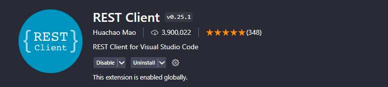

# QuickSale - Projeto Interdisciplinar de Conclusão de Curso


## Pré-visualização


## Descrição do Projeto

QuickSale é o Projeto Interdisciplinar de Conclusão do Curso de Desenvolvimento de Software com foco back-end da [Cubos Academy](https://cubos.academy/) que visa simular uma aplicação de frente de caixa. Atualmente, o projeto oferece os seguintes endpoints:

### Endpoints Públicos (acessíveis sem autenticação)

- Listar categorias:

  `GET` `/categorias`

  Exemplo de requisição

  ```json
  // Sem conteúdo no corpo (body) da requisição
  ```

- Cadastrar usuário:

  `POST` `/usuario`

  Exemplo de requisição

  ```json
  {
    "nome": "José",
    "email": "jose@email.com",
    "senha": "123456"
  }
  ```

- Efetuar login do usuário:

  `POST` `/login`

  Exemplo de requisição

  ```json
  {
    "email": "jose@email.com",
    "senha": "123456"
  }
  ```

### Endpoints Privados (requerem autenticação)

- Editar perfil do usuário logado:

  `PUT` `/usuario`

  Exemplo de requisição

  ```json
  {
    "nome": "José da Silva",
    "email": "josesilva@email.com",
    "senha": "abc456"
  }
  ```

- Detalhar perfil do usuário logado:

  `GET` `/usuario`

  Exemplo de requisição

  ```json
  // Sem conteúdo no corpo (body) da requisição
  ```

- Cadastrar produto

  `POST` `/produto`

  Exemplo de requisição

  ```json
  {
    "descricao": "Barra de chocolate",
    "quantidade_estoque": 120,
    "valor": 800, // em centavos
    "categoria_id": 4
  }
  ```

- Editar produto

  `PUT` `/produto/:id`

  Exemplo de requisição

  ```json
  {
    "descricao": "Chocolate em pó",
    "quantidade_estoque": 120,
    "valor": 1200,
    "categoria_id": 4
  }
  ```

- Listar produtos

  `GET` `/produto`

  Exemplo de requisição

  ```json
      //Sem conteúdo no corpo (body) da requisição
  ```

- Listar produtos por categoria

  `GET` `/produto?categoria_id`

  Exemplo de requisição

  ```json
      //Sem conteúdo no corpo (body) da requisição
  ```

- Detalhar produto

  `GET` `/produto/:id`

  Exemplo de requisição

  ```json
      //Sem conteúdo no corpo (body) da requisição
  ```

- Deletar produto

  `DELETE` `/produto/:id`

  Exemplo de requisição

  ```json
      //Sem conteúdo no corpo (body) da requisição
  ```

- Cadastrar cliente

  `POST` `/cliente`

  Exemplo de requisição

  ```json
  {
    "nome": "Maria",
    "email": "maria@email.com",
    "cpf": "11122233344",
    "cep": "13181779"
  }
  ```

- Editar dados do cliente

  `PUT` `/cliente/:id`

  Exemplo de requisição

  ```json
  {
    "nome": "Maria Sousa",
    "email": "mariasousa@email.com",
    "cpf": "11122233444",
    "cep": "13181779"
  }
  ```

- Listar clientes

  `GET` `/cliente`

  Exemplo de requisição

  ```json
      // Sem conteúdo no corpo (body) da requisição
  ```

###### ⚠ as seguintes rotas ainda estão em fase de construção/testes e podem sofrer alterações ou estar indisponíveis nos próximos dias.

- Cadastrar pedido

  `POST` `/pedido`

  Exemplo de requisição

  ```json
  {
    "cliente_id": 1,
    "observacao": "Em caso de ausência recomendo deixar com algum vizinho",
    "pedido_produtos": [
      {
        "produto_id": 1,
        "quantidade_produto": 10
      },
      {
        "produto_id": 2,
        "quantidade_produto": 20
      }
    ]
  }
  ```

- Listar pedidos

  `GET` `/pedido`

  Exemplo de requisição

  ```json
  // Sem conteúdo no corpo (body) da requisição
  ```

## Tecnologias Utilizadas

- Linguagem de Programação: Node.js
- Banco de Dados: PostgreSQL
- Autenticação de Usuário: JSON Web Token (JWT)
- Criptografia de Senhas: bcrypt
- Query Builder: Knex
- Validações: Joi

## Metodologia de Desenvolvimento

O projeto QuickSale segue a metodologia ágil SCRUM e faz uso da plataforma Trello para o gerenciamento de tarefas e sprints. O desenvolvimento é dividido em sprints e tem uma duração total de aproximadamente 3 semanas. Ressaltamos que tanto o README quanto o código do projeto estão em constante evolução e podem sofrer alterações ao longo do tempo.

## Testando a Aplicação

Para testar a aplicação, recomendamos o uso de uma ferramenta de teste de API, como o Insomnia. Você pode fazer as requisições diretamente para a seguinte URL:

[Link para a API QuickSale](https://fair-mittens-colt.cyclic.cloud)

Ou você pode realizar os testes com a extensão REST Client do VSCode. Para isso, basta seguir os passos abaixo.

1. **Certifique-se de que a extensão REST Client esteja instalada**:
   Se você não tem a extensão REST Client instalada no Visual Studio Code, você pode instalá-la a partir do Marketplace do VS Code.

   

2. **Abra um dos os arquivos de teste [`api-deploy.http`](./api-deploy.http) ou [`api-localhost.http`](./api-localhost.http)**:

   Certifique-se de iniciar o servidor caso escolha a opção `localhost` rodando o seguinte comando no terminal:
  
    ```npm run start```

3. **Acompanhe as respostas**:
   - Após enviar uma solicitação, você verá a resposta no painel inferior do VS Code.
   - As variáveis definidas nos testes, como `@token`, `@id`, `@idProduct`, etc., podem ser usadas para referenciar valores em solicitações subsequentes. Elas são definidas com o prefixo "@".

4. **Observação**:
   - Se você deseja usar as variáveis em solicitações posteriores, certifique-se de que as variáveis estejam definidas corretamente nas respostas anteriores, para que o REST Client possa recuperá-las.

Lembre-se de utilizar os endpoints mencionados acima de acordo com a descrição das funcionalidades.

## Desenvolvedoras

- [Lívia Nascimento](https://github.com/livnascimento)
- [Luiza Ferreira](https://github.com/LuhOli42)
- [Vitória Blau](https://github.com/viviblau)
